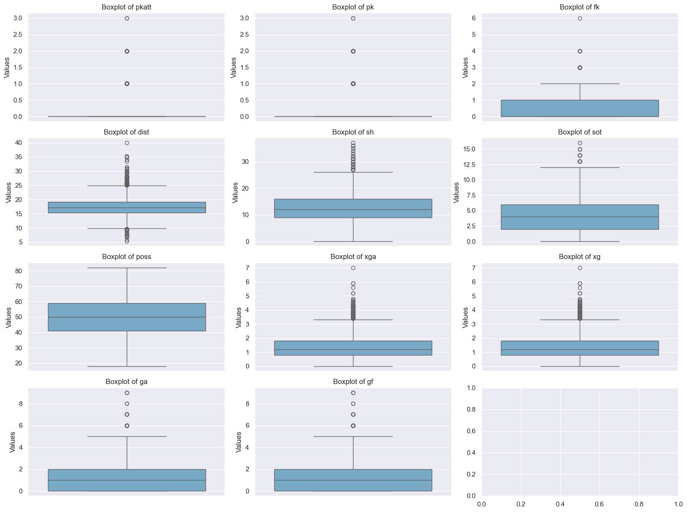
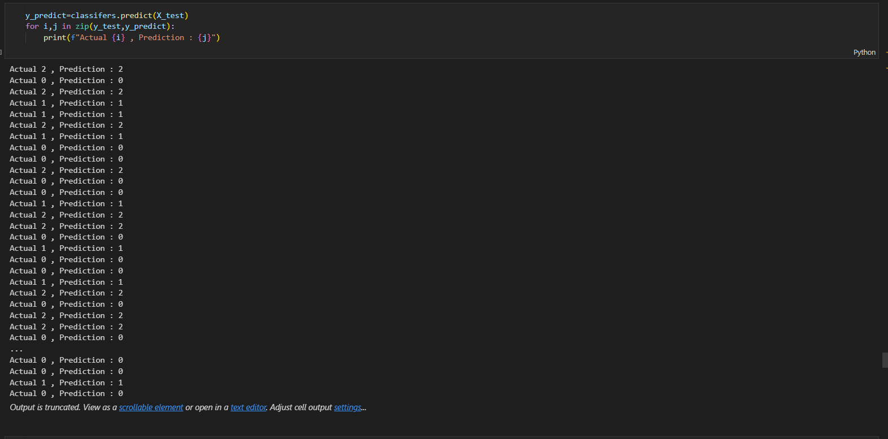

# Cào Dữ Liệu Bóng Đá và Dự Đoán Kết Quả Trận Đấu

Dự án này cào dữ liệu bóng đá từ các trang web và sử dụng dữ liệu đó để thực hiện dự đoán kết quả các trận đấu. Mô hình dự đoán được xây dựng dựa trên các đặc trưng của các đội bóng, tỷ số trận đấu trước đó, và các yếu tố khác như phong độ đội bóng, lịch sử đối đầu, và các chỉ số thống kê khác.
Trang web được dùng để cào dữ liệu ở đây là : **https://fbref.com/en/comps/9/Premier-League-Stats**
Và ở đây tôi chỉ cào dữ liệu từ năm 2024 đến năm 2017 , nếu bạn muốn thêm data để training thì có thể chỉnh lại biến **years** nhiều hơn
## Yêu Cầu

Trước khi bắt đầu, bạn cần cài đặt các thư viện sau:

1. **Python 3.11** (đảm bảo rằng bạn đã cài đặt Python 3 trở lên)
2. Các thư viện Python cần thiết:
   - pandas
   - numpy
   - requests
   - beautifulsoup4
   - selenium
   - webdriver-manager
   - scikit-learn
   - matplotlib
   - seaborn
   - xgboost
# Dự Án Trực Quan Hóa Dữ Liệu và Đánh Giá Mô Hình

## 1. Trực Quan Hóa Dữ Liệu

### Biểu Đồ Heatmap
Biểu đồ heatmap thể hiện sự tương quan giữa các dữ liệu sau khi đã tiến hành preprocessing.


### Biểu Đồ Pairplot
Biểu đồ pairplot giúp bạn trực quan hóa mối quan hệ giữa các cặp biến trong dữ liệu.


### Biểu Đồ Countplot
Biểu đồ countplot giúp bạn kiểm tra tần suất của các giá trị trong từng cột. Đồng thời, chúng ta cũng sẽ tìm kiếm upper bounds và lower bounds để phát hiện các outliers.



### Hình Dự Đoán Dựa Trên Dữ Liệu Chưa Được Huấn Luyện
Đây là hình ảnh kết quả dự đoán dựa trên `X_test` trước khi tiến hành huấn luyện mô hình.



---

## 2. Kết Quả Training

Các kết quả sau khi huấn luyện mô hình.


---

## 3. Các Metrics Để Đánh Giá Mô Hình

Dưới đây là các metrics để đánh giá hiệu quả của mô hình.


### Cài Đặt Thư Viện

1. Clone dự án về máy tính của bạn:
   ```bash
   git clone [[https://github.com/your-username/project-name.git](https://github.com/Kietnehi/Data_Analysis_Human_Resource.git)](https://github.com/Kietnehi/WebScrapingAndMakePredict.git)
2.Cài đặt các thư viện cần thiết từ file requirements.txt:
  ```bash
  pip install -r requirements.txt
