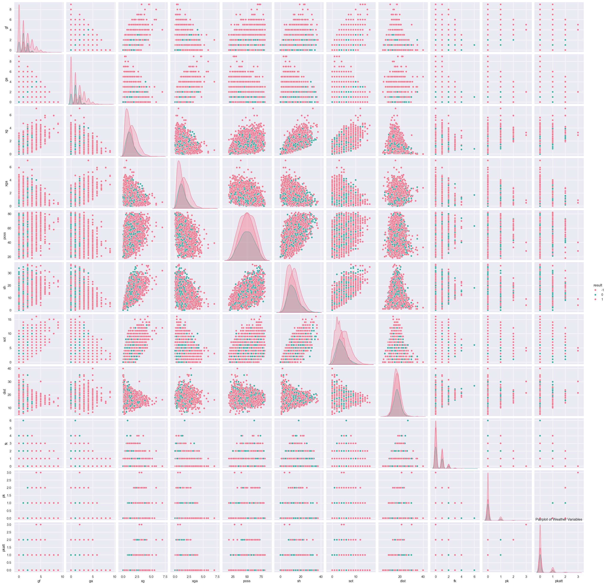

# Cào Dữ Liệu Bóng Đá và Dự Đoán Kết Quả Trận Đấu

Dự án này cào dữ liệu bóng đá từ các trang web và sử dụng dữ liệu đó để thực hiện dự đoán kết quả các trận đấu. Mô hình dự đoán được xây dựng dựa trên các đặc trưng của các đội bóng, tỷ số trận đấu trước đó, và các yếu tố khác như phong độ đội bóng, lịch sử đối đầu, và các chỉ số thống kê khác.
Trang web được dùng để cào dữ liệu ở đây là : **https://fbref.com/en/comps/9/Premier-League-Stats**
Và ở đây tôi chỉ cào dữ liệu từ năm 2024 đến năm 2017 , nếu bạn muốn thêm data để training thì có thể chỉnh lại biến **years** nhiều hơn
## Yêu Cầu

Trước khi bắt đầu, bạn cần cài đặt các thư viện sau:

1. **Python 3.11** (đảm bảo rằng bạn đã cài đặt Python 3 trở lên)
2. Các thư viện Python cần thiết:
   - pandas
   - numpy
   - requests
   - beautifulsoup4
   - selenium
   - webdriver-manager
   - scikit-learn
   - matplotlib
   - seaborn
   - xgboost
   - pytorch
   - argparse
# Dự Án Trực Quan Hóa Dữ Liệu và Đánh Giá Mô Hình

## 1. Trực Quan Hóa Dữ Liệu

### Biểu Đồ Heatmap
Biểu đồ heatmap thể hiện sự tương quan giữa các dữ liệu sau khi đã tiến hành preprocessing.


### Biểu Đồ Pairplot
Biểu đồ pairplot giúp bạn trực quan hóa mối quan hệ giữa các cặp biến trong dữ liệu.



### Biểu Đồ Countplot
Biểu đồ countplot giúp bạn kiểm tra tần suất của các giá trị trong từng cột. Đồng thời, chúng ta cũng sẽ tìm kiếm upper bounds và lower bounds để phát hiện các outliers.


### Hình Dự Đoán Dựa Trên Dữ Liệu Chưa Được Huấn Luyện
Đây là hình ảnh kết quả dự đoán dựa trên `X_test` trước khi tiến hành huấn luyện mô hình.


---

## 2. Kết Quả Training

Các kết quả sau khi huấn luyện mô hình.


---

## 3. Các Metrics Để Đánh Giá Mô Hình

Dưới đây là các metrics để đánh giá hiệu quả của mô hình.


### Cài Đặt Thư Viện

1. Clone dự án về máy tính của bạn:
   ```bash
   git clone [[[https://github.com/your-username/project-name.git](https://github.com/Kietnehi/Data_Analysis_Human_Resource.git)](https://github.com/Kietnehi/WebScrapingAndMakePredict.git)](https://github.com/Kietnehi/WebScrapingAndMakePredict.git)
2.Cài đặt các thư viện cần thiết từ file requirements.txt:
  ```bash
  pip install -r requirements.txt
 ---


3.Hướng dẫn chạy 
 .Ở đây tôi có 2 file để chạy là prediction.ipynb và predict.py
Trong dự án này, tôi cung cấp hai tệp chính để chạy:

- **`prediction.ipynb`**: Đây là tệp Jupyter Notebook dùng để huấn luyện mô hình học máy (machine learning) và học sâu (deep learning).
- **`predict.py`**: Tệp Python này được thiết kế với sự hỗ trợ của thư viện `Argparse`, giúp bạn dễ dàng điều chỉnh các tham số thông qua dòng lệnh.

### Cách Chạy `predict.py`
# Hướng dẫn sử dụng tham số huấn luyện mô hình

## Mô tả
Đây là hướng dẫn sử dụng các tham số cần thiết để huấn luyện một mô hình học máy. Các tham số này có thể được truyền vào thông qua dòng lệnh khi chạy script huấn luyện.

## Các tham số

### 1. `--num_epochs`
- **Mô tả**: Số lượng epoch cho quá trình huấn luyện mô hình. Một epoch là một lượt quét qua toàn bộ dữ liệu huấn luyện. 
- **Mặc định**: 100
- **Cách sử dụng**: 
    - Ví dụ: `--num_epochs 50` sẽ huấn luyện mô hình trong 50 epoch.
  
### 2. `--learning_rate`
- **Mô tả**: Tốc độ học (learning rate) quyết định mức độ điều chỉnh trọng số của mô hình trong mỗi bước cập nhật. Tốc độ học quá cao có thể khiến mô hình không hội tụ, trong khi tốc độ quá thấp có thể làm chậm quá trình huấn luyện.
- **Mặc định**: 0.001
- **Cách sử dụng**: 
    - Ví dụ: `--learning_rate 0.01` sẽ đặt tốc độ học là 0.01.

### 3. `--trained_models_dir`
- **Mô tả**: Thư mục chứa các mô hình đã huấn luyện. Sau khi quá trình huấn luyện hoàn tất, mô hình sẽ được lưu trữ vào thư mục này.
- **Mặc định**: `./model`
- **Cách sử dụng**: 
    - Ví dụ: `--trained_models_dir ./saved_models` sẽ lưu các mô hình vào thư mục `saved_models`.

### 4. `--checkpoint_path`
- **Mô tả**: Đường dẫn tới file checkpoint. Đây là một tham số tùy chọn. Nếu bạn không muốn sử dụng checkpoint, có thể bỏ qua tham số này. Checkpoint lưu trữ trạng thái của mô hình tại một thời điểm nhất định trong quá trình huấn luyện, giúp bạn có thể tiếp tục huấn luyện từ trạng thái đó hoặc sử dụng cho suy luận.
- **Mặc định**: Không có (không yêu cầu cung cấp tham số này)
- **Cách sử dụng**: 
    - Ví dụ: `--checkpoint_path ./model/checkpoint.pth` sẽ chỉ định đường dẫn đến file checkpoint.

### Cách sử dụng

Để huấn luyện mô hình với các tham số trên, bạn có thể chạy script huấn luyện thông qua dòng lệnh với cú pháp sau:

Để chạy `predict.py`, bạn có thể sử dụng lệnh sau trong Command Line:

```bash
python predict.py --num_epochs 100 --learning_rate 0.001 --trained_models_dir ./model --checkpoint_path ./model/checkpoint_epoch_29.pth

